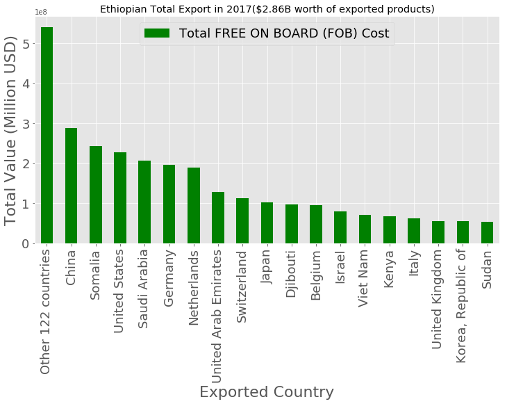
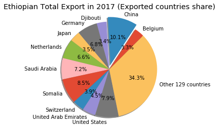
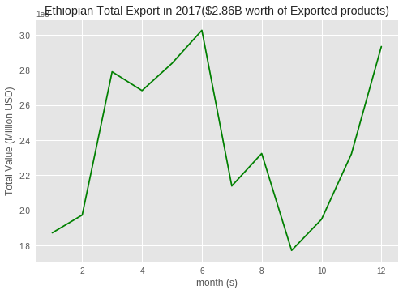
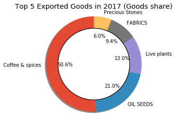
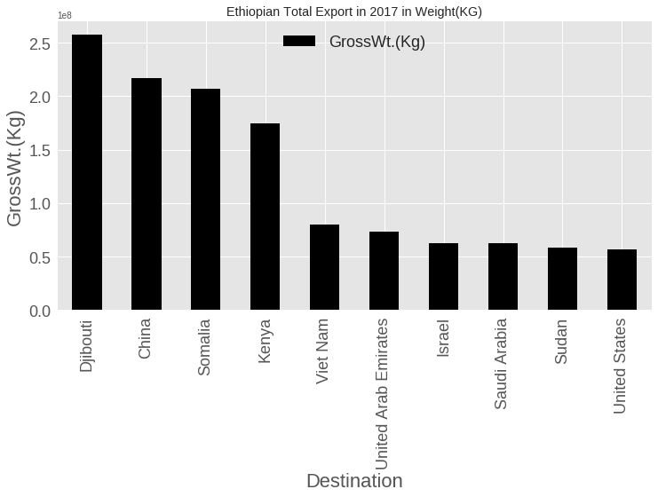
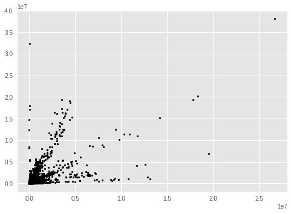
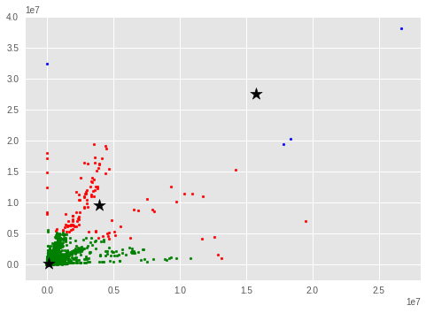

\# Analyzing Ethiopian export business using machine learning concept

\#\#\# Market data visualizations and clustering is stated as follows:

\------

\#\#\# Data visualizations

\#\#\#\# PYTHON command line

\`\`\`python

import pandas as pd

import numpy as np

import matplotlib.pyplot as plt

from copy import deepcopy

\#\# Read csv file locally

export_df=pd.read_csv("C:/export_2017_2.csv", encoding = "ISO-8859-1")

import_df=pd.read_csv("C://import_2017_2.csv", encoding = "ISO-8859-1")

\#\# Read from github

\#url =
'https://github.com/selamgit/AI-powered-data-driven-decisions-for-Ethiopian-Export-export-business/upload/master/Export_2017_2.csv'

\#export_df = pd.read_csv(io.StringIO(url))

\#\# Read csv file from colab.research.google

\#export_df =
pd.read_csv(io.StringIO(uploaded['Export_2017_2.csv'].decode('ISO-8859-1')))

\#export_df = export_df.rename(columns={c: c.replace(' ', '') for c in
export_df.columns}) \# Remove spaces from columns

\# Remove spaces from columns

export_df = export_df.rename(columns={c: c.replace(' ', '') for c in
export_df.columns})

export_df = export_df[['Month', 'HSCode', 'FOBValueUSD', 'Destination',
'GrossWt.(Kg)']]

\# show first 5 rows

import_df.head(5)

\`\`\`

\-----

\------

\#\#\#\# Show Import Data in bar chart

\`\`\`python

\#\#For bar chart select columns

country_value = export_df[['Destination','FOBValueUSD']]

country_group = country_value.groupby('Destination')

country_group.size()

total_export = country_group.sum()

big_export = total_export[total_export.FOBValueUSD \> 50000000].dropna()

small_export = total_export[total_export.FOBValueUSD \< 50000000].dropna()

\#get number of rows

rows, columns = small_export.shape

other_countries = (total_export.FOBValueUSD).sum() -
(big_export.FOBValueUSD).sum()

long_export_df = big_export.reset_index()

long_export_df.loc[-1] = ['Other '+str(rows)+' countries' , other_countries]

long_export_df = long_export_df.reset_index(drop=True)

export1 = long_export_df.sort_values('FOBValueUSD',ascending=False)

export1 = export1.set_index('Destination')

year_total = (total_export.FOBValueUSD).sum()

my_plot = export1.plot(fontsize=18,figsize=(12, 6),kind='bar',title="Ethiopian
Total Export in 2017(\$2.86B worth of exported products)", color="green")

my_plot.legend(["Total FREE ON BOARD (FOB) Cost"],loc=9, ncol=4,fontsize=18)

my_plot.set_xlabel("Exported Country",fontsize=22)

my_plot.set_ylabel("Total Value (Million USD)",fontsize=22)

\`\`\`

\-----

\------

\#\#\#\# Show Import Market Share by Country

\`\`\`python

\#\# Use pie chart to show market share by country

country_share_value = export_df[['Destination','FOBValueUSD']]

country_share_group = country_share_value.groupby('Destination',as_index =
False)

country_share_group.size()

total_country_share = country_share_group.sum()

big_share = total_country_share[total_country_share.FOBValueUSD \>
80000000].dropna()

small_share = total_country_share[total_country_share.FOBValueUSD \<
80000000].dropna()

others_share = (total_country_share.FOBValueUSD).sum() -
(big_share.FOBValueUSD).sum()

country_list = big_share["Destination"].unique()

all_country_list = list(big_share.FOBValueUSD)

all_country_list.append(others_share)

\#print(all_country_list)

rows, columns = small_share.shape \# get number of rows

lst = list(country_list)

lst.append('Other '+str(rows)+' countries')

country_labels = np.asarray(lst)

lst_number = len(country_labels) \# get length of the list

explod_lst = ([i for i in range(lst_number-1)])

explod_lst = [x \* 0 for x in explod_lst] \# multiply all integers inside list
by 0

explod_lst.insert(1, 0.1) \# insert explod index

tuple(explod_lst) \# convert it into tuple

explod = explod_lst

fig1, ax1 = plt.subplots()

ax1.pie(all_country_list, labels=country_labels, explode=explod,
autopct='%1.1f%%',shadow=True, startangle=45)

ax1.axis('equal') \# Equal aspect ratio ensures that pie is drawn as a circle.

ax1.set_title('Ethiopian Total Export in 2017 (Exported countries share)')

plt.show()

\`\`\`

\------

\------

\#\#\#\# Show imported values per months

\`\`\`python

\#\#For line chart - show Exported values per months

monthly_value = export_df[['Month','FOBValueUSD']]

month_group = monthly_value.groupby('Month')

month_group.size()

month_totals = month_group.sum()

plt.plot(month_totals, "g-")

plt.xlabel('month (s)')

plt.ylabel('Total Value (Million USD)')

plt.title('Ethiopian Total Export in 2017(\$2.86B worth of Exported products)')

plt.grid(True)

plt.show()

\`\`\`

\------

\------

\#\#\#\# Show top 5 traded goods

\`\`\`python

\#\# Top 5 Traded goods

goods_exported = export_df[['HSCode', 'FOBValueUSD']]

\#\# get first 2 hscode

goods_group = goods_exported.groupby(goods_exported.HSCode.astype(str).str[:5])

\#goods_group = goods_exported.groupby('HSCode')

goods_group.size()

goods_total = goods_group.sum()

goods_total.head(5)

top_export_goods =
goods_total.sort_values('FOBValueUSD',ascending=False).head(5)

HS_description = ['Coffee & spices', 'OIL SEEDS', 'Live plants','FABRICS',
'Precious Stones']

print("Top 5 Export in 2017:")

top_export_goods['HS Description'] = HS_description

print(top_export_goods)

fig1, ax1 = plt.subplots()

ax1.pie(top_export_goods.FOBValueUSD, labels=HS_description,
autopct='%1.1f%%',shadow=True, startangle=90)

ax1.axis('equal') \# Equal aspect ratio ensures that pie is drawn as a circle.

ax1.set_title('Top 5 Exported Goods in 2017 (Goods share)')

\#draw a circle at the center of pie to make it look like a donut

centre_circle = plt.Circle((0,0),0.75,color='black', fc='white',linewidth=1.25)

fig = plt.gcf()

fig.gca().add_artist(centre_circle)

\# Set aspect ratio to be equal so that pie is drawn as a circle.

plt.axis('equal')

plt.show()

\`\`\`

\------

\------

\#\#\#\# Show traded goods by weight in kg

\`\`\`python

\#\# Traded goods in kg

goods_exported = export_df[['Destination','GrossWt.(Kg)']]

\#\# get first 2 hscode

goods_group = goods_exported.groupby(goods_exported.Destination)

\#goods_group = goods_exported.groupby('HSCode')

goods_group.size()

goods_total = goods_group.sum()

goods_total.head(5)

top_export_goods =
goods_total.sort_values('GrossWt.(Kg)',ascending=False).head(10)

print(top_export_goods)

my_plot = top_export_goods.plot(fontsize=18,figsize=(12,
6),kind='bar',title="Ethiopian Total Export in 2017 in Weight(KG)",
color="black")

my_plot.legend(["GrossWt.(Kg)"],loc=9, ncol=4,fontsize=18)

my_plot.set_xlabel("Destination",fontsize=22)

my_plot.set_ylabel("GrossWt.(Kg)",fontsize=22)

\`\`\`

\------

\------

\#\#\#\# K-Means Clustering

\`\`\`python

\#\# show data set

goods_exported = export_df[['HSCode','GrossWt.(Kg)', 'FOBValueUSD']]

\# Getting the values and plotting it

f1 = goods_exported['GrossWt.(Kg)'].values

f2 = goods_exported['FOBValueUSD'].values

X = np.array(list(zip(f1, f2)))

plt.scatter(f1, f2, c='black', s=7)

plt.show()

\`\`\`

\------

\------

\`\`\`python

\# Euclidean Distance Caculator

def dist(a, b, ax=1):

return np.linalg.norm(a - b, axis=ax)

\# Number of clusters

k = 3

\# X coordinates of random centroids

C_x = np.random.randint(0, np.max(X)-20, size=k)

\# Y coordinates of random centroids

C_y = np.random.randint(0, np.max(X)-20, size=k)

C = np.array(list(zip(C_x, C_y)), dtype=np.float32)

print(C)

\# To store the value of centroids when it updates

C_old = np.zeros(C.shape)

\# Cluster Lables(0, 1, 2)

clusters = np.zeros(len(X))

\# Error func. - Distance between new centroids and old centroids

error = dist(C, C_old, None)

\# Loop will run till the error becomes zero

while error != 0:

\# Assigning each value to its closest cluster

for i in range(len(X)):

distances = dist(X[i], C)

cluster = np.argmin(distances)

clusters[i] = cluster

\# Storing the old centroid values

C_old = deepcopy(C)

\# Finding the new centroids by taking the average value

for i in range(k):

points = [X[j] for j in range(len(X)) if clusters[j] == i]

C[i] = np.mean(points, axis=0)

error = dist(C, C_old, None)

colors = ['r', 'g', 'b', 'y', 'c', 'm']

fig, ax = plt.subplots()

for i in range(k):

points = np.array([X[j] for j in range(len(X)) if clusters[j] == i])

ax.scatter(points[:, 0], points[:, 1], s=7, c=colors[i])

ax.scatter(C[:, 0], C[:, 1], marker='\*', s=200, c='\#050505')

\`\`\`

\------

\------

\#\# License

This project is licensed under the MIT License - see the

[LICENSE.md](LICENSE.md) file for details
