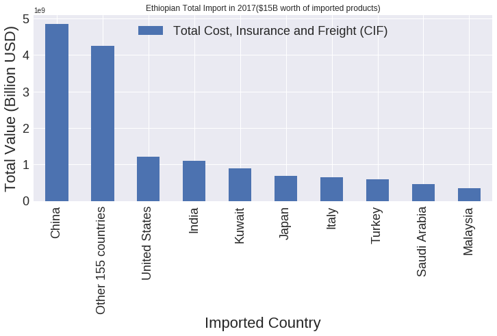

# Analyzing Ethiopian import business using machine learning concept

### Basic Market data visualizations and clustering is stated as follows:

#### PYTHON command line

```python

import pandas as pd

import numpy as np

import matplotlib.pyplot as plt

## Read csv file locally
df=pd.read_csv("C:/Downloads/import_2017_2.csv", encoding = "ISO-8859-1")

## Read from github
#url = 'https://github.com/selamgit/AI-powered-data-driven-decisions-for-Ethiopian-import-export-business/upload/master/import_2017_2.csv'

#df = pd.read_csv(io.StringIO(url))
## Read csv file from colab.research.google

#df = pd.read_csv(io.StringIO(uploaded['import_2017_2.csv'].decode('ISO-8859-1')))

# Remove spaces from columns
df = df.rename(columns={c: c.replace(' ', '') for c in df.columns}) 

df = df[['Month', 'HSCode', 'CIFValueUSD', 'CountryOrigin', 'HSDescription','GrossWt.(Kg)']]

#first 5 rows
df.head(5)

```
-----


------

#### Show Import Data in bar chart

```python

##For bar chart - select columns

country_value = df[['CountryOrigin','CIFValueUSD']]

country_group = country_value.groupby('CountryOrigin')

country_group.size()

total_import = country_group.sum()

big_import = total_import[total_import.CIFValueUSD > 300000000].dropna()

small_import= total_import[total_import.CIFValueUSD < 300000000].dropna()


# get number of rows
rows, columns = small_import.shape 

other_countries = (total_import.CIFValueUSD).sum() - (big_import.CIFValueUSD).sum()

long_df = big_import.reset_index()

long_df.loc[-1] = ['Other '+str(rows)+' countries' , other_countries]

long_df = long_df.reset_index(drop=True)

import1 = long_df.sort_values('CIFValueUSD',ascending=False)

import1 = import1.set_index('CountryOrigin')

year_total = (total_import.CIFValueUSD).sum()

# bar chart ploting
my_plot = import1.plot(fontsize=18,figsize=(12, 9),kind='bar',title="Ethiopian
Total Import in 2017($15B worth of imported products)")

my_plot.legend(["Total Cost, Insurance and Freight (CIF)"],loc=9,
ncol=4,fontsize=18)

my_plot.set_xlabel("Imported Country",fontsize=22)

my_plot.set_ylabel("Total Value (Billion USD)",fontsize=22)

```

-----



------

#### Show Import Market Share by Country

```python

## Use pie chart to show market share by country

country_share_value = df[['CountryOrigin','CIFValueUSD']]

country_share_group = country_share_value.groupby('CountryOrigin',as_index = False)

country_share_group.size()

total_country_share = country_share_group.sum()

big_share = total_country_share[total_country_share.CIFValueUSD > 300000000].dropna()

small_share = total_country_share[total_country_share.CIFValueUSD < 300000000].dropna()

others_share = (total_country_share.CIFValueUSD).sum() - (big_share.CIFValueUSD).sum()

country_list = big_share["CountryOrigin"].unique()

all_country_list = list(big_share.CIFValueUSD)

all_country_list.append(others_share)

#print(all_country_list)

# get number of rows
rows, columns = small_share.shape 

lst = list(country_list)

lst.append('Other '+str(rows)+' countries')

country_labels = np.asarray(lst)

# get length of the list
lst_number = len(country_labels) 

explod_lst = ([i for i in range(lst_number-1)])

# to make them all zero, multiply all integers inside the list by 0
explod_lst = [x * 0 for x in explod_lst] 

# insert explod index
explod_lst.insert(0, 0.1) 

# convert it into tuple
tuple(explod_lst) 

explod = explod_lst

# pie chart ploting
fig1, ax1 = plt.subplots()

ax1.pie(all_country_list, labels=country_labels, explode=explod, autopct='%1.1f%%',shadow=True, startangle=180)

ax1.axis('equal') # Equal aspect ratio ensures that pie is drawn as a circle.

ax1.set_title('Ethiopian Total Import in 2017 (Imported countries share)')

plt.show()

```

------


------

#### Show imported values per months

```python

##For line chart - show imported values per months

monthly_value = df[['Month','CIFValueUSD']]

month_group = monthly_value.groupby('Month')

month_group.size()

month_totals = month_group.sum()

plt.plot(month_totals)

plt.xlabel('month (s)')

plt.ylabel('Total Value (Million USD)')

plt.title('Ethiopian Total Import in 2017($15B worth of imported products)')

plt.grid(True)

plt.show()

```

------


------
#### K-Means Clustering

```python

## show data set

# Getting the values and plotting it
goods_imported = df[['HSCode','GrossWt.(Kg)',  'CIFValueUSD']]

# Getting the values and plotting it
f1 = goods_imported['GrossWt.(Kg)'].values
f2 = goods_imported['CIFValueUSD'].values
X = np.array(list(zip(f1, f2)))
plt.scatter(f1, f2, c='black', s=7)

plt.show()

```

------


------
####  Set number of clusters

```python

# Euclidean Distance Caculator
def dist(a, b, ax=1):
    return np.linalg.norm(a - b, axis=ax)

# Number of clusters
k = 2

# X coordinates of random centroids
C_x = np.random.randint(0, np.max(X)-20, size=k)

# Y coordinates of random centroids
C_y = np.random.randint(0, np.max(X)-20, size=k)

C = np.array(list(zip(C_x, C_y)), dtype=np.float32)

print(C)

# To store the value of centroids when it updates
C_old = np.zeros(C.shape)

# Cluster Lables(0, 1, 2)
clusters = np.zeros(len(X))

# Error func. - Distance between new centroids and old centroids error = dist(C, C_old, None)
# Loop will run till the error becomes zero
while error != 0:
    # Assigning each value to its closest cluster
    for i in range(len(X)):
    
        distances = dist(X[i], C)
        
        cluster = np.argmin(distances)
        
        clusters[i] = cluster
        
    # Storing the old centroid values
    
    C_old = deepcopy(C)
    
    # Finding the new centroids by taking the average value
    for i in range(k):
    
        points = [X[j] for j in range(len(X)) if clusters[j] == i]
        
        C[i] = np.mean(points, axis=0)
        
    error = dist(C, C_old, None)
    
colors = ['r', 'g', 'b', 'y', 'c', 'm']

fig, ax = plt.subplots()

for i in range(k):

        points = np.array([X[j] for j in range(len(X)) if clusters[j] == i])
        
        ax.scatter(points[:, 0], points[:, 1], s=7, c=colors[i])
        
ax.scatter(C[:, 0], C[:, 1], marker='*', s=200, c='#050505')

```

------


------
## License

This project is licensed under the MIT License - see the
[LICENSE.md](LICENSE.md) file for details
