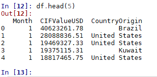
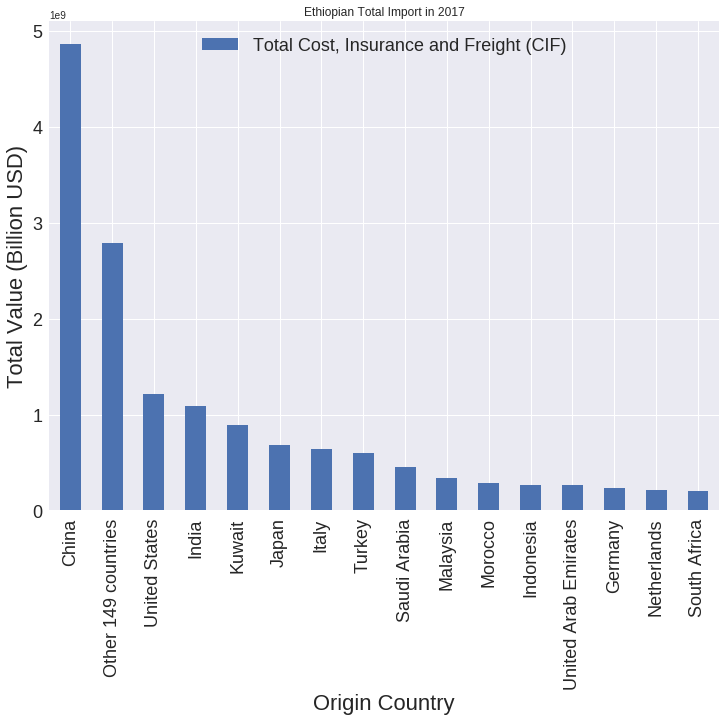
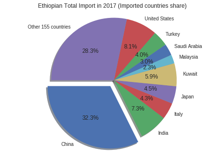
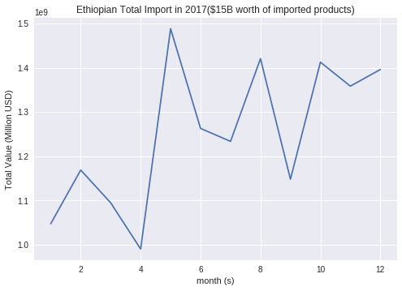

# AI powered data driven-decisions for Ethiopian import-export business

Currently, Ethiopia is one of the fastest-growing economies in the world and
many import/export business analysts ask is how to find the best overseas market
to boost a company’s imports/exports.

However, it is not easy to find intuitive and descriptive market analysis
data to make the right decision based on previous data and predict the
future market. Therefore, this projects aims to help analysts to find actionable
insights and make data driven decisions by using machine learning concept.

The project has three major stages:

1.  Data Collection and Visualizing current market from different data sources
    such as UN, the World Bank and official governmental sites.

2.  Data Cleaning, Categorization and Normalization.

3.  Build AI system for looking for the Best Performing Import/Export Markets,
    market Saturation, looking for the Most Promising Markets.

4.  Creation of fully automated Artificial Intelligence Analyst System from data
    collection to Generate Market Analysis and Forecasts.

### The first stage (data collection and market visualizations) is stated as follows:

------

### Prerequisites

PYTHON 3.6

### Let’s start

#### PYTHON command line

```python

import pandas as pd

import numpy as np

import matplotlib.pyplot as plt

## Read csv file locally

df=pd.read_csv("C:/Downloads/import_2017_2.csv", encoding = "ISO-8859-1")

## Read from github

#url = 'https://github.com/selamgit/AI-powered-data-driven-decisions-for-Ethiopian-import-export-business/upload/master/import_2017_2.csv'

#df = pd.read_csv(io.StringIO(url))

## Read csv file from colab.research.google

#df = pd.read_csv(io.StringIO(uploaded['import_2017_2.csv'].decode('ISO-8859-1')))

# Remove spaces from columns
df = df.rename(columns={c: c.replace(' ', '') for c in df.columns}) 

df = df[['Month', 'CIFValueUSD', 'CountryOrigin']]

#first 5 rows
df.head(5)

```
-----



------

#### Show Import Data in bar chart

```python

##For bar chart - select columns

country_value = df[['CountryOrigin','CIFValueUSD']]

country_group = country_value.groupby('CountryOrigin')

country_group.size()

total_import = country_group.sum()

big_import = total_import[total_import.CIFValueUSD > 300000000].dropna()

small_import= total_import[total_import.CIFValueUSD < 300000000].dropna()


# get number of rows
rows, columns = small_import.shape 

other_countries = (total_import.CIFValueUSD).sum() - (big_import.CIFValueUSD).sum()

long_df = big_import.reset_index()

long_df.loc[-1] = ['Other '+str(rows)+' countries' , other_countries]

long_df = long_df.reset_index(drop=True)

import1 = long_df.sort_values('CIFValueUSD',ascending=False)

import1 = import1.set_index('CountryOrigin')

year_total = (total_import.CIFValueUSD).sum()

# bar chart ploting
my_plot = import1.plot(fontsize=18,figsize=(12, 9),kind='bar',title="Ethiopian
Total Import in 2017($15B worth of imported products)")

my_plot.legend(["Total Cost, Insurance and Freight (CIF)"],loc=9,
ncol=4,fontsize=18)

my_plot.set_xlabel("Imported Country",fontsize=22)

my_plot.set_ylabel("Total Value (Billion USD)",fontsize=22)

```

-----



------

#### Show Import Market Share by Country

```python

## Use pie chart to show market share by country

country_share_value = df[['CountryOrigin','CIFValueUSD']]

country_share_group = country_share_value.groupby('CountryOrigin',as_index = False)

country_share_group.size()

total_country_share = country_share_group.sum()

big_share = total_country_share[total_country_share.CIFValueUSD > 300000000].dropna()

small_share = total_country_share[total_country_share.CIFValueUSD < 300000000].dropna()

others_share = (total_country_share.CIFValueUSD).sum() - (big_share.CIFValueUSD).sum()

country_list = big_share["CountryOrigin"].unique()

all_country_list = list(big_share.CIFValueUSD)

all_country_list.append(others_share)

#print(all_country_list)

# get number of rows
rows, columns = small_share.shape 

lst = list(country_list)

lst.append('Other '+str(rows)+' countries')

country_labels = np.asarray(lst)

# get length of the list
lst_number = len(country_labels) 

explod_lst = ([i for i in range(lst_number-1)])

# to make them all zero, multiply all integers inside the list by 0
explod_lst = [x * 0 for x in explod_lst] 

# insert explod index
explod_lst.insert(0, 0.1) 

# convert it into tuple
tuple(explod_lst) 

explod = explod_lst

# pie chart ploting
fig1, ax1 = plt.subplots()

ax1.pie(all_country_list, labels=country_labels, explode=explod, autopct='%1.1f%%',shadow=True, startangle=180)

ax1.axis('equal') # Equal aspect ratio ensures that pie is drawn as a circle.

ax1.set_title('Ethiopian Total Import in 2017 (Imported countries share)')

plt.show()

```

------



------

#### Show imported values per months

```python

##For line chart - show imported values per months

monthly_value = df[['Month','CIFValueUSD']]

month_group = monthly_value.groupby('Month')

month_group.size()

month_totals = month_group.sum()

plt.plot(month_totals)

plt.xlabel('month (s)')

plt.ylabel('Total Value (Million USD)')

plt.title('Ethiopian Total Import in 2017($15B worth of imported products)')

plt.grid(True)

plt.show()

```

------



------

## Author

***Selam Waktola** - *selam.waktola@gmail.com* -
[selamgit](https://github.com/selamgit)

## License

This project is licensed under the MIT License - see the
[LICENSE.md](LICENSE.md) file for details
