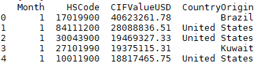
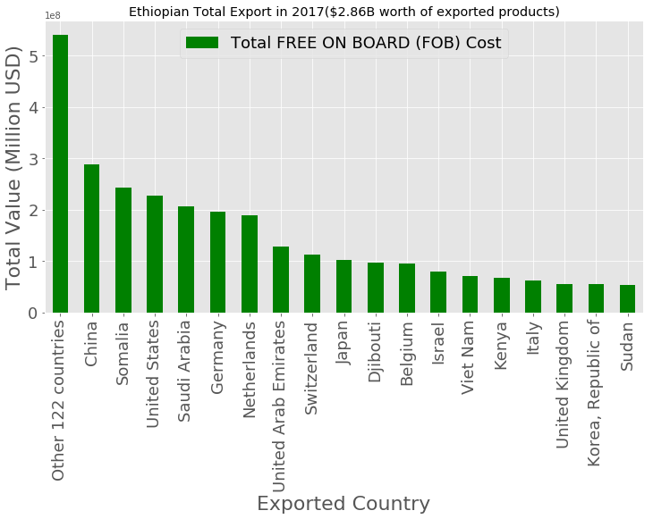
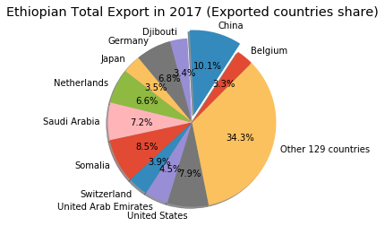
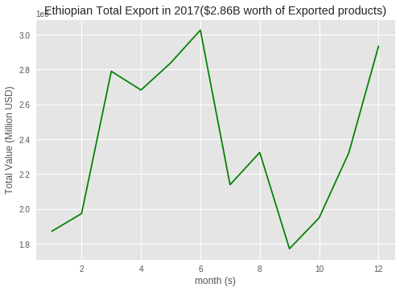
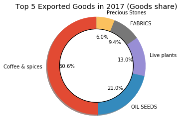
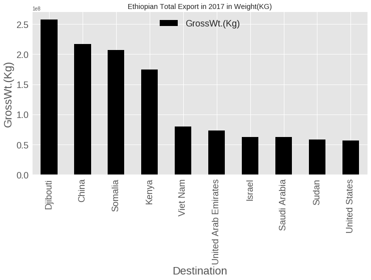
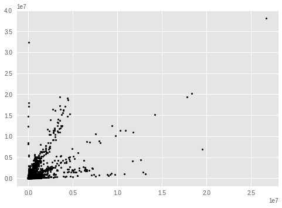
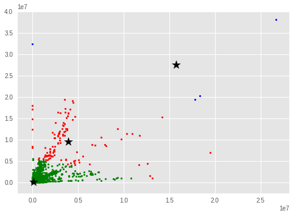

# AI powered data driven-decisions for Ethiopian import-export business

Currently, Ethiopia is one of the fastest-growing economies in the world and
many import/export business analysts ask is how to find the best overseas market
to boost a company’s imports/exports.

However, it is not easy to find intuitive and descriptive market analysis
data to make the right decision based on previous data and predict the
future market. Therefore, this projects aims to help analysts to find actionable
insights and make data driven decisions by using machine learning concept.

The project has three major stages:

1.  Data Collection and Visualizing current market from different data sources
    such as UN, the World Bank and official governmental sites.

2.  Data Cleaning, Categorization and Normalization.

3.  Build AI system for looking for the Best Performing Import/Export Markets,
    market Saturation, looking for the Most Promising Markets.

4.  Creation of fully automated Artificial Intelligence Analyst System from data
    collection to Generate Market Analysis and Forecasts.
    
- [Exported data analysis](https://github.com/selamgit/AI-powered-data-driven-decisions-for-Ethiopian-import-export-business/blob/master/ExportedGoods.md)
- [Imported data analysis](https://github.com/selamgit/AI-powered-data-driven-decisions-for-Ethiopian-import-export-business/blob/master/ImportedGoods.md)

### The first stage (data collection and market visualizations) is stated as follows:
### At the end basic k-means clustering is also included:
------

### Prerequisites

PYTHON 3.6

### Let’s start


#### PYTHON command line

```python

import pandas as pd

import numpy as np

import matplotlib.pyplot as plt

from copy import deepcopy

## Read csv file locally
export_df=pd.read_csv("C:/export_2017_2.csv", encoding = "ISO-8859-1")

## Read csv file from colab.research.google
#export_df = pd.read_csv(io.StringIO(uploaded['Export_2017_2.csv'].decode('ISO-8859-1')))

# Remove spaces from columns
#export_df = export_df.rename(columns={c: c.replace(' ', '') for c in export_df.columns})

export_df = export_df[['Month', 'HSCode', 'FOBValueUSD', 'Destination', 'GrossWt.(Kg)']]

# show first 5 rows
import_df.head(5)

```

-----



------

#### Show Export Data in bar chart

```python

##For bar chart select columns
country_value = export_df[['Destination','FOBValueUSD']]

country_group = country_value.groupby('Destination')

country_group.size()

total_export = country_group.sum()

# Let say values greator than 50000000 is big share
big_export = total_export[total_export.FOBValueUSD > 50000000].dropna()
# Let say values less than 50000000 is small share
small_export = total_export[total_export.FOBValueUSD < 50000000].dropna()

#get number of rows
rows, columns = small_export.shape

other_countries = (total_export.FOBValueUSD).sum() - (big_export.FOBValueUSD).sum()

long_export_df = big_export.reset_index()

long_export_df.loc[-1] = ['Other '+str(rows)+' countries' , other_countries]

long_export_df = long_export_df.reset_index(drop=True)

export1 = long_export_df.sort_values('FOBValueUSD',ascending=False)

export1 = export1.set_index('Destination')

year_total = (total_export.FOBValueUSD).sum()

my_plot = export1.plot(fontsize=18,figsize=(12, 6),kind='bar',title="Ethiopian Total Export in 2017($2.86B worth of exported products)", color="green")

my_plot.legend(["Total FREE ON BOARD (FOB) Cost"],loc=9, ncol=4,fontsize=18)

my_plot.set_xlabel("Exported Country",fontsize=22)

my_plot.set_ylabel("Total Value (Million USD)",fontsize=22)

```

-----



------

#### Show Exported Market Share by Country

```python

## Use pie chart to show market share by country
country_share_value = export_df[['Destination','FOBValueUSD']]

country_share_group = country_share_value.groupby('Destination',as_index = False)

country_share_group.size()

total_country_share = country_share_group.sum()

# Let say values greator than 80000000 is big share
big_share = total_country_share[total_country_share.FOBValueUSD > 80000000].dropna()
# Let say values less than 80000000 is small share
small_share = total_country_share[total_country_share.FOBValueUSD < 80000000].dropna()

others_share = (total_country_share.FOBValueUSD).sum() - (big_share.FOBValueUSD).sum()

country_list = big_share["Destination"].unique()

all_country_list = list(big_share.FOBValueUSD)

all_country_list.append(others_share)

#print(all_country_list)

rows, columns = small_share.shape # get number of rows

lst = list(country_list)

lst.append('Other '+str(rows)+' countries')

country_labels = np.asarray(lst)

lst_number = len(country_labels) # get length of the list

explod_lst = ([i for i in range(lst_number-1)])

explod_lst = [x * 0 for x in explod_lst] # multiply all integers inside list by 0

explod_lst.insert(1, 0.1) # insert explod index

tuple(explod_lst) # convert it into tuple

explod = explod_lst

fig1, ax1 = plt.subplots()

ax1.pie(all_country_list, labels=country_labels, explode=explod, autopct='%1.1f%%',shadow=True, startangle=45)

ax1.axis('equal') # Equal aspect ratio ensures that pie is drawn as a circle.

ax1.set_title('Ethiopian Total Export in 2017 (Exported countries share)')

plt.show()

```

------



------

#### Show exported values per months

```python

##For line chart - show Exported values per months

monthly_value = export_df[['Month','FOBValueUSD']]

month_group = monthly_value.groupby('Month')

month_group.size()

month_totals = month_group.sum()

plt.plot(month_totals, "g-")

plt.xlabel('month (s)')

plt.ylabel('Total Value (Million USD)')

plt.title('Ethiopian Total Export in 2017($2.86B worth of Exported products)')

plt.grid(True)

plt.show()

```

------



------

#### Show top 5 exported goods

```python

## Top 5 exported goods

goods_exported = export_df[['HSCode', 'FOBValueUSD']]

## get first 5 hscode
goods_group = goods_exported.groupby(goods_exported.HSCode.astype(str).str[:5])

goods_group.size()

goods_total = goods_group.sum()

goods_total.head(5)

top_export_goods = goods_total.sort_values('FOBValueUSD',ascending=False).head(5)

# refer HSCode description from WTO DB
HS_description = ['Coffee & spices', 'OIL SEEDS', 'Live plants','FABRICS', 'Precious Stones']

print("Top 5 Export in 2017:")

top_export_goods['HS Description'] = HS_description

print(top_export_goods)

fig1, ax1 = plt.subplots()

ax1.pie(top_export_goods.FOBValueUSD, labels=HS_description, autopct='%1.1f%%',shadow=True, startangle=90)

ax1.axis('equal') # Equal aspect ratio ensures that pie is drawn as a circle.

ax1.set_title('Top 5 Exported Goods in 2017 (Goods share)')

#draw a circle at the center of pie to make it look like a donut
centre_circle = plt.Circle((0,0),0.75,color='black', fc='white',linewidth=1.25)

fig = plt.gcf()

fig.gca().add_artist(centre_circle)

# Set aspect ratio to be equal so that pie is drawn as a circle.
plt.axis('equal')

plt.show()

```

------



------

#### Show exported goods by weight in kg

```python

## Exported goods in kg

goods_exported = export_df[['Destination','GrossWt.(Kg)']]

goods_group = goods_exported.groupby(goods_exported.Destination)

goods_group.size()

goods_total = goods_group.sum()

goods_total.head(5)

top_export_goods = goods_total.sort_values('GrossWt.(Kg)',ascending=False).head(10)

print(top_export_goods)

my_plot = top_export_goods.plot(fontsize=18,figsize=(12, 6),kind='bar',title="Ethiopian Total Export in 2017 in Weight(KG)",
color="black")

my_plot.legend(["GrossWt.(Kg)"],loc=9, ncol=4,fontsize=18)

my_plot.set_xlabel("Destination",fontsize=22)

my_plot.set_ylabel("GrossWt.(Kg)",fontsize=22)

```

------



------

#### K-Means Clustering

```python

## show data set

goods_exported = export_df[['HSCode','GrossWt.(Kg)', 'FOBValueUSD']]

# Getting the values and plotting it
f1 = goods_exported['GrossWt.(Kg)'].values

f2 = goods_exported['FOBValueUSD'].values

X = np.array(list(zip(f1, f2)))

plt.scatter(f1, f2, c='black', s=7)

plt.show()

```

------



------
####  Set number of clusters

```python

# Euclidean Distance Caculator
def dist(a, b, ax=1):

return np.linalg.norm(a - b, axis=ax)

# Set number of clusters
k = 3

# X coordinates of random centroids
C_x = np.random.randint(0, np.max(X)-20, size=k)

# Y coordinates of random centroids
C_y = np.random.randint(0, np.max(X)-20, size=k)

C = np.array(list(zip(C_x, C_y)), dtype=np.float32)

print(C)

# To store the value of centroids when it updates
C_old = np.zeros(C.shape)

# Cluster Lables(0, 1, 2)
clusters = np.zeros(len(X))

# Error func. - Distance between new centroids and old centroids
error = dist(C, C_old, None)

# Loop will run till the error becomes zero
while error != 0:

# Assigning each value to its closest cluster
for i in range(len(X)):

distances = dist(X[i], C)

cluster = np.argmin(distances)

clusters[i] = cluster

# Storing the old centroid values
C_old = deepcopy(C)

# Finding the new centroids by taking the average value
for i in range(k):

points = [X[j] for j in range(len(X)) if clusters[j] == i]

C[i] = np.mean(points, axis=0)

error = dist(C, C_old, None)

colors = ['r', 'g', 'b', 'y', 'c', 'm']

fig, ax = plt.subplots()

for i in range(k):

points = np.array([X[j] for j in range(len(X)) if clusters[j] == i])

ax.scatter(points[:, 0], points[:, 1], s=7, c=colors[i])

ax.scatter(C[:, 0], C[:, 1], marker='*', s=200, c='#050505')

```

------



------

## Author

***Selam Waktola** - *selam.waktola@gmail.com* -
[selamgit](https://github.com/selamgit)

## License

This project is licensed under the MIT License - see the
[LICENSE.md](LICENSE.md) file for details
